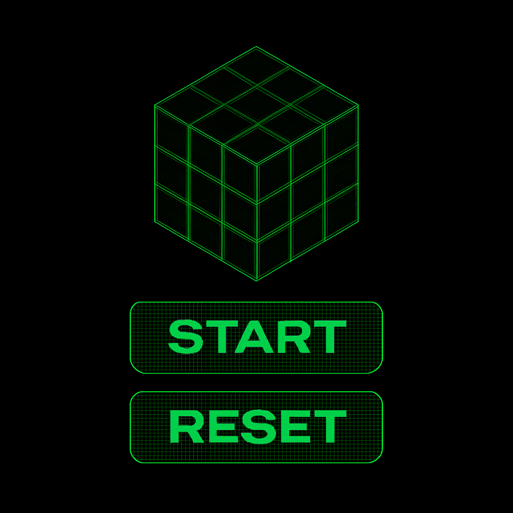

<h1>⏱️ Desafio concluído: Cronômetro com HTML, CSS e JS!</h1>

<h3>Essa semana me desafiei a criar um cronômetro do zero usando apenas HTML, CSS e JavaScript puro.
 Além da lógica de tempo, aproveitei pra trabalhar estilos e interações visuais — inclusive já testando a identidade visual que vou usar no meu segundo portfólio 👀</h3>

<h4>Os botões animados e o loader 3D são só um gostinho do que vem por aí!
Mais um passo prático na minha evolução como dev 🚀</h4>

Deploy: https://lnkd.in/gyui_n6u

